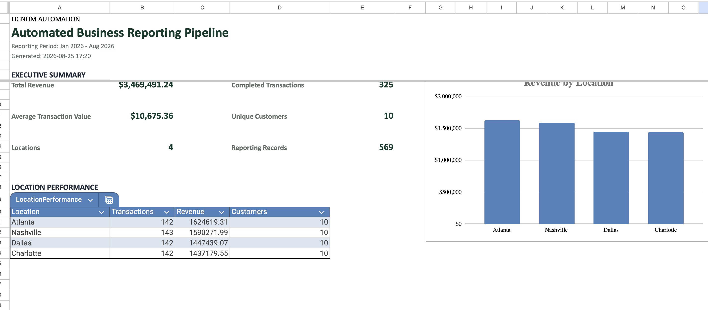

# Automated Business Reporting Pipeline

A production-style Python automation that consolidates recurring business files, validates data quality, standardizes records, identifies exceptions, and automatically generates management-ready reporting.

Built as a demonstration project for **Lignum Automation**.
## Example Output



The pipeline converts raw multi-location business files into a validated, management-ready report with automated KPIs, performance summaries, exception reporting, and trend analysis.
---

## Business Problem

Many businesses still rely on repetitive reporting workflows such as:

1. Receiving CSV and Excel files from multiple locations
2. Manually combining the files
3. Cleaning inconsistent data
4. Checking for missing or invalid records
5. Calculating KPIs
6. Building recurring management reports
7. Investigating data-quality problems

These workflows can consume hours every reporting cycle and introduce opportunities for manual error.

This project demonstrates how that process can be automated with Python.

---

## Solution

The pipeline automatically:

- Discovers incoming CSV and Excel files
- Loads multiple files without hard-coded filenames
- Combines data from multiple business locations
- Tracks the source file for each record
- Validates required columns
- Detects duplicate transactions
- Identifies missing customer information
- Identifies missing sales representatives
- Detects invalid dates
- Detects invalid quantities
- Detects negative or invalid revenue
- Standardizes location names
- Cleans text and numeric fields
- Creates a validated reporting dataset
- Generates an exception report
- Produces an automated management workbook
- Creates location, product, and monthly performance summaries

---

## Workflow

```text
CSV / Excel Files
        |
        v
   File Ingestion
        |
        v
 Schema Validation
        |
        v
Exception Detection
        |
        v
 Data Cleaning
        |
        v
Validated Dataset
        |
        v
 KPI Calculation
        |
        v
Management Reporting
